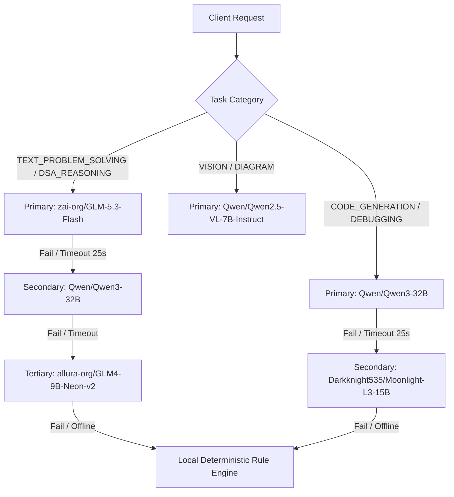

# SmartZero — AI Agent Architecture & Reasoning Pipeline

> A comprehensive specification of the SmartZero AI Agent subsystem, natural-language understanding (NLU), story normalization pipeline, model routing, and deterministic fallback mechanics.

---

## 1. Overview of the AI Layer

The SmartZero AI Agent serves as an intelligent pedagogical copilot. Its purpose is **not** to generate raw drawing coordinates or simulate memory mutations in an ungrounded LLM context, but to:
1. **Understand Intent**: Accurately classify what kind of help the learner needs (e.g., visual demonstration, theoretical explanation, complexity analysis, code debugging).
2. **Normalize Story Problems**: Strip competitive programming story wrappers (e.g., "Chef", "Alice and Bob", "Kingdoms and Bridges") and extract core computational parameters (inputs, targets, constraints).
3. **Synthesize Structured Teaching Plans**: Formulate a step-by-step pedagogical progression with clear objectives, candidate approach trade-offs, and verification steps.
4. **Evaluate Learner Predictions**: Diagnose learner predictions during interactive steps and provide targeted feedback without revealing the final solution prematurely.

---

## 2. NLU & Intent Classification (`agent/nlu.ts`)

Incoming user queries pass through `interpretDSAQuery` in `agent/nlu.ts`. The NLU engine classifies requests into one of 14 typed intents defined in `ai/schemas.ts`:

| Intent Enum | Description | Example Query |
|:---|:---|:---|
| `visualize` | Requests an animated whiteboard walkthrough | *"Show me Bubble Sort step-by-step"* |
| `explain` | Conceptual or theoretical explanation | *"What is an AVL tree and why do we rotate?"* |
| `theory` | Deep algorithmic invariants or proofs | *"Why does Dijkstra fail with negative edges?"* |
| `implementation`| Multi-language code request | *"Write Kadane's algorithm in C++ and Python"* |
| `trace` | Step-by-step dry-run on specific inputs | *"Trace Binary Search on [1, 3, 7, 9] for target 7"* |
| `complexity` | Big-O time and space complexity inquiry | *"What is the worst-case space complexity of Merge Sort?"* |
| `compare` | Direct comparison between two techniques | *"Compare BFS vs DFS"* or *"Array vs Linked List"* |
| `problem_solving`| Story, competitive programming, or custom problem | *"Chef has 4 numbers... find the missing number"* |
| `debugging` | Finding a bug in learner-submitted code | *"Why does my while loop give an off-by-one error?"* |
| `code_explanation`| Explaining an existing code snippet | *"Explain line 12 in the quicksort implementation"* |
| `example` | Requesting concrete input/output examples | *"Give me an example of a monotonic stack problem"* |
| `edge_case` | Exploring boundary and edge conditions | *"What happens in Two Sum if no pair exists?"* |
| `clarification`| Ambiguous request requiring disambiguation | *"Help me with trees"* |
| `unsupported_non_dsa`| Queries outside the computer science domain | *"What is the weather today?"* |

---

## 3. Story Normalization & Problem Parsing (`agent/problemSolver.ts`)

Learners frequently paste questions from LeetCode, Codeforces, HackerRank, or university exams that wrap simple algorithms inside elaborate story scenarios:

```text
Story Input:
"Chef has 4 pieces of paper with numbers 1, 2, 4, 5.
 The numbers were supposed to add up to 15.
 One piece of paper was dropped.
 Find the missing number."
                      │
                      ▼
[NLU Normalization: parseProblemStatement()]
                      │
                      ├─ Extracted Numbers: [1, 2, 4, 5]
                      ├─ Extracted Target / Sum: 15
                      ├─ Problem Category: "math / arrays"
                      ├─ Canonical Problem Type: "missing-number"
                      └─ Normalized Task: "Find missing integer in range [1..5]"
```

### Zero False-Positive Routing Safeguard
A critical defect in naive DSA chatbots is **force-matching**: mapping an unknown question to an unrelated popular topic simply because it mentions numbers or arrays.

> [!IMPORTANT]
> **Strict Anti-Cross-Contamination Rule**:
> SmartZero's problem parser explicitly enforces that arithmetic, story, or logic problems **MUST NEVER** be force-matched to unrelated canonical topics:
> - *"Decrement OR Increment N by 1 if divisible by 4"* routes strictly to `decrement-or-increment` (never to Two Pointers or Array Traversal).
> - *"Given A, B, C, print YES if avg(A, B) > C"* routes strictly to `greater-average` (never to Graph BFS).
> - Generic math operations generate a `generic-arithmetic-comparison` or `generic-programming-problem` plan with dedicated visual steps.

---

## 4. The 42 Specialized Problem Solvers

`agent/problemSolver.ts` provides complete, deterministic solution plans for 42 specialized problem classes:

1. **Arrays & Subarrays**: `two-sum`, `max-subarray` (Kadane), `stock-buy-sell`, `move-zeroes`, `remove-duplicates`, `max-subarray-k`, `prefix-sum`, `longest-substring-no-repeat`.
2. **Searching & Sorting**: `binary-search`, `search-rotated-array`, `second-max`.
3. **Linked Lists**: `reverse-linked-list`, `detect-linked-list-cycle`.
4. **Stacks & Queues**: `valid-parentheses`, `queue-using-stacks`, `next-greater-element`.
5. **Hash Tables & Sets**: `missing-number`, `first-repeating-element`, `top-k-frequent`.
6. **Trees & Heaps**: `tree-traversal`, `bst-search`, `heap-sort`.
7. **Graphs**: `number-of-islands`, `bfs-shortest-path`, `dfs-connected-components`, `dijkstra`, `union-find`.
8. **Dynamic Programming**: `climbing-stairs`, `coin-change`, `lcs`.
9. **Backtracking & Recursion**: `generate-subsets`, `n-queens`.
10. **Math & Number Theory**: `prime-number`, `armstrong-number`, `factorial`, `fibonacci`, `gcd-lcm`, `palindrome-check`.
11. **Applied Story & Logic**: `greater-average`, `decrement-or-increment`, `percentage-change`, `shop-bill`, `generic-arithmetic-comparison`, `generic-programming-problem`.

Each solver generates a complete `ProblemSolutionPlan`:
- **Normalized Problem Statement & Objective**
- **Candidate Approaches**: Brute force vs Optimal, with time/space complexity trade-offs.
- **Dry-Run Trace**: Step-by-step variable transitions.
- **Visual DSL Steps**: Semantic visual actions executable on the Excalidraw whiteboard.
- **Multi-Language Code**: Idiomatic implementations in JavaScript, Python, and C++.
- **Interactive Learner Question**: Formulated to test the learner's understanding at the critical inflection step.

---

## 5. Model Routing & Featherless AI Integration (`ai/modelRouter.ts`)

SmartZero routes queries to [Featherless AI](https://featherless.ai/) using an OpenAI-compatible API client:



### Dynamic Model Discovery
On initialization, `ai/modelRouter.ts` queries the Featherless catalog (`${BASE_URL}/models`):
- Filters out gated models and models exceeding context length constraints.
- Caches available models in-memory for 1 hour (`CACHE_TTL_MS = 3600000`).
- If discovery fails (e.g. offline or DNS failure), uses `DEFAULT_KNOWN_MODELS` catalog.

---

## 6. Deterministic Fallback Provider (`ai/provider.ts`)

If `SMARTZERO_ENABLE_LIVE_AI=false`, or if `FEATHERLESS_API_KEY` is not provided, SmartZero activates `DeterministicFallbackProvider`:
- Emits fully structured responses conforming strictly to `AIResponseSchema` and `DSATaskSchema`.
- Leverages the canonical registry in `engine/registry.ts` and the 42 solvers in `agent/problemSolver.ts`.
- Guarantees that hackathon evaluation, continuous integration, and local demonstrations never fail due to API outages or token limits.

---

## 7. Schema Validation & Structured Output (`ai/schemas.ts`)

All communication between the client, API route handlers, and AI models is strictly enforced via Zod schemas:

### Core Schemas:
- **`InterpretRequestSchema`**:
  ```typescript
  z.object({
    question: z.string().min(1).max(5000),
    imageBase64: z.string().optional(),
    context: z.object({
      topicId: z.string().nullable().optional(),
      lessonId: z.string().nullable().optional(),
      language: z.enum(["javascript", "cpp", "python"]).optional(),
      mode: z.string().optional(),
      teachSummary: z.string().optional(),
    }).optional(),
  })
  ```
- **`DSATaskSchema`**: The master contract returned by `/api/interpret`. Contains normalized `intent`, `lessonId`, `topicId`, `problemPlan`, `customLesson`, and `codeSnippets`.
- **`EvaluateRequestSchema`**: Validates prediction responses (`{ expectedId: string, choiceId: string }`).
- **`HintRequestSchema`**: Contextual hint request containing active step indices and question prompts.

---

*For whiteboard layout and rendering specifications, proceed to [CANVAS_ENGINE.md](CANVAS_ENGINE.md).*
