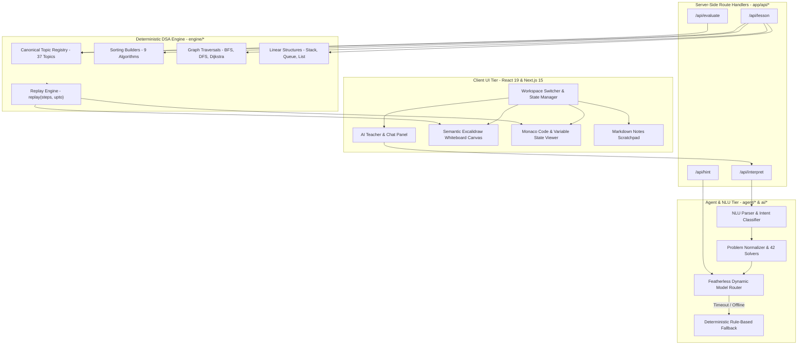
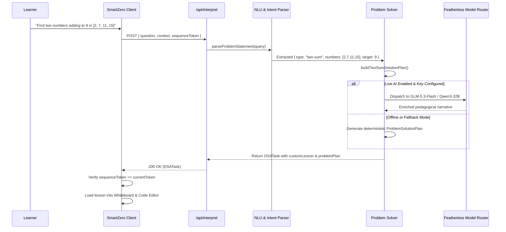

# SmartZero — Technical Architecture Specification

> An in-depth technical specification of SmartZero's architecture, data contracts, deterministic replay mechanics, and agentic workflows.

---

## 1. High-Level Architecture Overview

SmartZero strictly decouples **high-level pedagogical reasoning** from **low-level deterministic visual execution**. The architecture is structured across four primary layers:



---

## 2. Core Architectural Principle: "AI Decides WHAT. The Engine Decides HOW."

A foundational failure mode of LLM-generated visualizations is **geometric hallucination**:
- LLMs are prone to miscalculating pixel coordinates, overlapping elements, producing invalid SVG paths, or skipping indices.
- When an LLM directly emits coordinates or Excalidraw JSON, backward step navigation is impossible, and visual drift accumulates over multi-step lessons.

### The SmartZero Invariant
1. **The AI outputs semantic intents only**: e.g.,
   ```typescript
   {
     action: "highlight_element",
     index: 3,
     role: "active-pointer",
     message: "Inspecting pivot element at index 3"
   }
   ```
2. **The Deterministic Engine computes geometry**:
   The engine reads the semantic intent, looks up the current layout matrix, and mathematically positions cells, pointer vectors, bounding brackets, and operation cards.
3. **Discrete State Reconstruction**:
   ```typescript
   export function replay(steps: LessonStep[], upto: number): RuntimeState
   ```
   State is never mutated incrementally without a path to clean reconstruction. Replaying steps $0 \dots N$ from scratch guarantees zero accumulated visual artifacts.

---

## 3. Frontend Architecture (Next.js 15 & React 19)

The client application is built with the Next.js App Router (`app/layout.tsx`, `app/page.tsx`):
- **SSR Safety**: `@excalidraw/excalidraw` and `@monaco-editor/react` rely on browser window objects. They are dynamically loaded with `ssr: false` to guarantee clean server hydration.
- **Client Root (`components/SmartZero.tsx`)**:
  Serves as the central state orchestrator coordinating:
  1. The top header (workspace tabs, theme toggle, speed controls).
  2. The left AI Teacher panel (chat history, quick actions, lesson objectives).
  3. The center Excalidraw whiteboard canvas (`SemanticCanvas.tsx`).
  4. The right panel (Monaco code viewer, state variables table, Markdown notes).

---

## 4. Agent & NLU Subsystem (`agent/` & `ai/`)

When a learner types a prompt (e.g. *"Chef has 4 numbers... find the missing one"*), the agentic pipeline processes the request through four stages:



### Problem Normalization
The problem normalizer (`agent/problemSolver.ts`) strips story wrappers (e.g., "Chef", "Bob", "Alice", "Exam Question") and maps queries to one of **42 specialized problem solvers**, including:
- **Arrays & Pointers**: Two Sum, Remove Duplicates, Move Zeroes, Kadane's Max Subarray, Sliding Window Maximum.
- **Searching & Math**: Binary Search, Rotated Array Search, Prime Check ($6k \pm 1$), Armstrong Numbers, Decrement or Increment, Greater Average.
- **Linear Structures**: Valid Parentheses, Reverse Linked List, Cycle Detection, Queue using Stacks.
- **Trees & Graphs**: BST Search & Insertion, BFS Shortest Path, Dijkstra, Connected Components, Island Count.
- **Dynamic Programming & Backtracking**: Climbing Stairs, Coin Change, Longest Common Subsequence, N-Queens.

---

## 5. Semantic Visual DSL & Action Grammar

Every step of an algorithm is represented as an array of typed `DSLAction` objects defined in `types/dsa.ts`:

| Action Type | Payload Arguments | Pedagogical Effect |
|:---|:---|:---|
| `reset_scene` | None | Flushes the canvas and resets the whiteboard coordinate system. |
| `create_array` | `{ values: number[] }` | Renders a high-contrast contiguous array of cells at $y \approx 110$. |
| `highlight_element` | `{ index: number, role?: string }` | Emphasizes an element (green for selected, red for mismatch, amber for candidate). |
| `dim_elements` | `{ indices: number[] }` | Dims eliminated search halves or discarded negative prefixes. |
| `set_pointer` | `{ index: number, label: string }` | Places a labeled pointer (`↓ low`, `↑ mid`, `write →`) above or below a cell. |
| `remove_pointer` | `{ label: string }` | Removes an active pointer vector. |
| `swap_elements` | `{ from: number, to: number }` | Animates the exchange of two cell positions. |
| `set_sorted_region`| `{ start: number, end: number }` | Draws a persistent green boundary indicating the sorted or unique prefix. |
| `set_sliding_window`| `{ start: number, end: number, label?: string }` | Draws an active bracket around the current contiguous sliding window. |
| `show_operation_card`| `{ title: string, formula: string, decision: string }` | Displays a compact `[▶ OPERATION & DECISION]` card below the data structure. |
| `set_variable` | `{ name: string, value: string \| number }` | Registers a state variable rendered in the horizontal state table. |
| `create_linked_list`| `{ nodes: LinkedListNode[] }` | Renders pointer-chain nodes (`[val \| •] → [val \| null]`). |
| `relink_next` | `{ fromId: string, toId: string \| null }` | Reverses or mutates a linked-list edge. |
| `create_tree` | `{ root: TreeNode }` | Renders a balanced or binary search tree with branched edges. |
| `create_graph` | `{ nodes: GraphNode[], edges: GraphEdge[] }`| Renders an undirected or directed weighted graph. |
| `visit_graph_node` | `{ id: string }` | Marks a graph node as visited (turns node fill green). |
| `create_queue` / `create_stack` | `{ items: string[] }` | Renders auxiliary FIFO queue or LIFO stack memory buffers. |

---

## 6. Canvas Layout Engine (`components/SemanticCanvas.tsx`)

The semantic canvas renders on top of `@excalidraw/excalidraw` using a deterministic coordinate system:

```text
  y = 20   ┌─────────────────────────────────────────────────────────────┐
           │ WHITEBOARD HEADER: Title, Subtitle, Time/Space Complexity   │
           └─────────────────────────────────────────────────────────────┘
  y = 110  ┌─────────────────────────────────────────────────────────────┐
           │ "DATA STRUCTURE AS HERO" REGION:                            │
           │ Array Cells (76px × 62px) / Tree Nodes / Graph Vertices    │
           │ Pointers: ↓ low, mid (Grouped to prevent collision)         │
           └─────────────────────────────────────────────────────────────┘
  y = 230  ┌─────────────────────────────────────────────────────────────┐
           │ [▶ OPERATION & DECISION] COMPACT CARD:                      │
           │ Formula: max(nums[i], currentSum + nums[i])                │
           │ Decision: Drop negative prefix, start new window            │
           └─────────────────────────────────────────────────────────────┘
  y = 320  ┌─────────────────────────────────────────────────────────────┐
           │ STATE VARIABLES: currentSum = 4 | bestSum = 6 | i = 3       │
           └─────────────────────────────────────────────────────────────┘
```

### Pointer Collision Grouping
When multiple pointers target the exact same index (e.g. `low` and `mid` in Binary Search, or `read` and `write` in Remove Duplicates), standard visualizers draw text on top of text, rendering them illegible. 

SmartZero's canvas engine groups pointer labels into a single composite banner:
```typescript
// If pointer "low" and pointer "mid" both point to index 2:
// Output label: "↓ low, mid" centered cleanly beneath cell 2.
```

---

## 7. Multi-Language Code Synchronization

SmartZero maintains full code synchronization across **JavaScript**, **Python**, and **C++**:
- Each `LessonStep` includes an optional `codeLine: string` identifier (e.g., `"while_loop"`, `"check_mid"`, `"relink"`).
- In `components/SmartZero.tsx`, the Monaco editor matches `step.codeLine` against internal line maps for each language.
- As the user clicks **Next Step**, the corresponding line of Python or JavaScript is highlighted in the editor, and its executed variables update simultaneously in the state table.

---

## 8. Workspace Isolation & Stale-Response Protection

Users can open multiple tabs (e.g., Tab 1: "Binary Search", Tab 2: "Kadane's Algorithm", Tab 3: "Dijkstra"):

### Sequence Token Protection
When asynchronous operations (such as AI interpretation) are in flight, switching tabs or typing new queries could lead to **race conditions** where a late-resolving response from Tab 1 overwrites Tab 2.

SmartZero enforces strict **monotonic sequence tokens**:
```typescript
// In components/SmartZero.tsx:
const sequenceToken = ++currentWorkspace.sequenceToken;

const response = await fetch("/api/interpret", { ... });
const data = await response.json();

// Check if workspace is still active and token is current:
if (sequenceToken !== currentWorkspace.sequenceToken) {
  // Stale async response discarded - workspace switched or newer query issued
  return;
}
```

---

## 9. AI Model Routing & Fallback Architecture

The AI layer (`ai/modelRouter.ts`) connects to Featherless AI's OpenAI-compatible API:
1. **Model Discovery**: Queries `${BASE_URL}/models` on startup.
2. **Context-Aware Ranking**:
   - For reasoning and natural-language story questions: ranks `zai-org/GLM-5.3-Flash`, `Qwen/Qwen3-32B`.
   - For code generation: ranks code-specialized models.
3. **Graceful Degradation**:
   - If an API call fails or times out after 25 seconds, the router automatically fails over to the next candidate model in the chain.
   - If all cloud endpoints fail, SmartZero falls back to the in-memory deterministic rule-based engine.

---

## 10. Persistence & Supabase Integration

SmartZero supports client-side and cloud persistence:
- **Local Storage**: Active workspaces, notes, code snippets, and UI theme persist in `localStorage` under keys `smartzero_workspaces_v1` and `smartzero_theme_v1`.
- **Supabase Cloud Schema (`supabase/schema.sql`)**:
  - `workspaces`: Contains title, topic ID, runtime step, and serialized canvas elements.
  - `chat_messages`: Stores contextual conversation turns per workspace.
  - `notes`: Markdown scratchpad content per workspace.
  - **Row Level Security (RLS)**: Enforces that users can only access their own workspaces based on authenticated user IDs.

---

*For detailed visual canvas mechanics, proceed to [CANVAS_ENGINE.md](CANVAS_ENGINE.md).*
