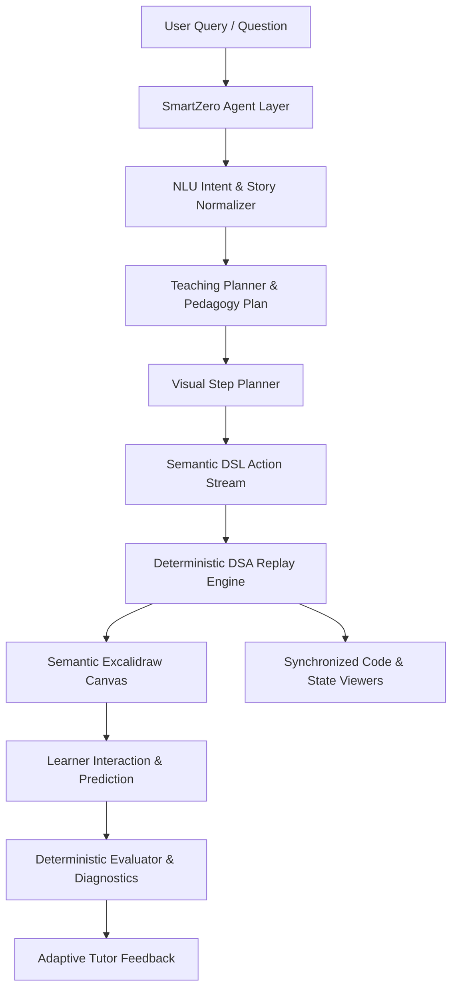

# SmartZero
> An agentic visual DSA learning platform where AI teaching, an interactive semantic canvas, deterministic DSA execution, and synchronized code work together.

[](https://nextjs.org/)
[](https://react.dev/)
[](https://www.typescriptlang.org/)
[](https://excalidraw.com/)
[](#testing--verification-metrics)
[](#development-commands)
[](#license)

---

## What is SmartZero?

SmartZero is a specialized **Agentic Visual DSA (Data Structures & Algorithms) Teaching Workspace**. It bridges the gap between high-level AI reasoning and rigorous, deterministic computer science education.

* **SmartZero is NOT just a chatbot**: It does not merely emit walls of markdown text or static code snippets.
* **SmartZero is NOT just an Excalidraw wrapper**: It does not expect learners or LLMs to manually draw boxes and drag arrows.
* **SmartZero is NOT just a code generator**: It does not leave learners staring at uncommented implementations.

Instead, SmartZero operates as an **interactive, pedagogical peer**:
1. **AI DSA Teacher**: Formulates structured teaching plans, diagnoses learner misconceptions, and adapts pacing to the student.
2. **Interactive Semantic Canvas**: Uses Excalidraw as a high-fidelity algorithmic whiteboard driven strictly by a deterministic visual DSL.
3. **Deterministic DSA Engine**: Drives discrete state transitions, variable dry-runs, and pointer movements with zero hallucination.
4. **Synchronized 4-Way Surface**: At every step of playback, the **AI Explanation**, **Whiteboard Canvas**, **Code Line**, and **State Variables** represent the exact same computational step.

```text
User Question / Story Problem
              │
              ▼
   AI Problem Understanding (NLU & Story Normalization)
              │
              ▼
     Structured Teaching Plan & Visual Plan
              │
              ▼
        Semantic Visual DSL Actions
              │
              ▼
    Deterministic DSA Engine (State Transitions & Replay)
              │
              ├───────────────────────────────┐
              ▼                               ▼
    Semantic Whiteboard Canvas       Synchronized Code & State
       (Excalidraw Grammar)             (JS / Python / C++)
              │                               │
              └───────────────┬───────────────┘
                              ▼
                Learner Prediction & Interaction
                              │
                              ▼
                Misconception Detection & Evaluation
                              │
                              ▼
                   Adaptive Tutor Feedback
```

---

## Why SmartZero?

Traditional programming pedagogy and modern generative AI tools suffer from an "understanding chasm":

| Traditional Generative AI | SmartZero Agentic Teaching Platform |
|:---|:---|
| **Question $\to$ Text Explanation $\to$ Raw Code Dump** | **Question $\to$ Understand $\to$ Plan $\to$ Visualize $\to$ Step-by-Step Execution** |
| Passive reading without state verification | Active learner predictions with deterministic validation |
| Static, disconnected code blocks | Highlighting exact code lines synchronized with canvas changes |
| Hallucinated intermediate states | Discrete replay engine with mathematically verified pointer steps |
| Learner gets overwhelmed by syntax | "Data Structure as Hero" layout highlights algorithmic mechanics |

### The Product Vision: "Figma/Excalidraw for DSA"

SmartZero brings the fluid, intuitive visual workspace of modern design tools (like Figma and Excalidraw) into computer science education. By pairing an infinite hand-drawn whiteboard canvas with deterministic execution, learners build visual mental models of pointers, memory segments, recursion stacks, and graph traversals.

---

## Key Features

- **AI DSA Teacher & Guided Pedagogy**: Contextual conversational tutor that explains algorithm logic, provides on-demand hints, and crafts multi-step pedagogical plans.
- **Natural-Language Problem Solving**: Normalizes complex story problems, competitive programming questions, and exam inquiries into structured algorithmic specifications (supporting 42 specialized problem types).
- **Interactive Semantic Canvas**: Excalidraw-powered whiteboard rendering arrays, linked lists, trees, graphs, queues, stacks, hash tables, pointers, sliding windows, and operation decision cards.
- **Deterministic DSA Engine & Step Playback**: Step forward, step backward, auto-play, pause, and variable-speed execution ($0.5\times$ to $2\times$) with zero accumulated rendering drift.
- **Learner Prediction Questions & Diagnostic Feedback**: Embedded comprehension questions testing next-pointer moves and time complexities, backed by instant deterministic misconception diagnosis.
- **Multi-Language Synchronized Code**: Dynamic syntax-highlighted code viewer in JavaScript, Python, and C++ with active line tracking synchronized with canvas mutations.
- **Teach Mode & Palette**: Structured curriculum palette allowing learners or educators to trigger canonical algorithm demonstrations across 22 DSA categories.
- **Isolated Multi-Workspaces**: Tabbed workspace manager allowing users to maintain multiple concurrent DSA explorations with complete isolation of state, chat history, canvas, and notes.
- **Integrated Markdown Notes**: Dedicated per-workspace scratchpad with live preview for taking notes during study sessions.
- **Dual AI Provider Architecture**: High-speed cloud model routing via Featherless AI (GLM-5.3-Flash for reasoning, Qwen3-32B for DSA code) paired with an offline deterministic fallback engine.

---

## Supported DSA

SmartZero includes **22 DSA Categories** and **37 Registered Topics** in its canonical registry (`engine/registry.ts`), with **18 Deterministic Canonical Engines**, **29 Canonical Lessons** (`engine/lessons.ts`), and **42 Specialized Problem Solvers** (`agent/problemSolver.ts`):

| Category | Canonical Topic | Deterministic Engine | Visual Type | Code Sync | Complexity (Avg / Space) |
|:---|:---|:---:|:---:|:---:|:---:|
| **Sorting** | Bubble Sort (`bubble-sort`) | Yes | Array | JS, C++, Python | $O(n^2)$ / $O(1)$ |
| **Sorting** | Selection Sort (`selection-sort`) | Yes | Array | JS, C++, Python | $O(n^2)$ / $O(1)$ |
| **Sorting** | Insertion Sort (`insertion-sort`) | Yes | Array | JS, C++, Python | $O(n^2)$ / $O(1)$ |
| **Sorting** | Merge Sort (`merge-sort`) | Yes | Array | JS, C++, Python | $O(n \log n)$ / $O(n)$ |
| **Sorting** | Quick Sort (`quick-sort`) | Yes | Array | JS, C++, Python | $O(n \log n)$ / $O(\log n)$ |
| **Sorting** | Heap Sort (`heap-sort`) | Yes | Array | JS, C++, Python | $O(n \log n)$ / $O(1)$ |
| **Sorting** | Counting Sort (`counting-sort`) | Yes | Array | JS, C++, Python | $O(n + k)$ / $O(k)$ |
| **Sorting** | Radix Sort (`radix-sort`) | Yes | Array | JS, C++, Python | $O(d \cdot (n + k))$ / $O(n + k)$ |
| **Sorting** | Bucket Sort (`bucket-sort`) | Yes | Array | JS, C++, Python | $O(n)$ / $O(n)$ |
| **Searching** | Binary Search (`binary-search`) | Yes | Array | JS, C++, Python | $O(\log n)$ / $O(1)$ |
| **Searching** | Linear Search (`linear-search`) | No (Conceptual) | Conceptual | JS, C++, Python | $O(n)$ / $O(1)$ |
| **Arrays** | Second Maximum (`second-max`) | Yes | Array | JS, C++, Python | $O(n)$ / $O(1)$ |
| **Arrays** | Two Pointers (`two-pointers`) | No (Conceptual) | Conceptual | JS, C++, Python | $O(n)$ / $O(1)$ |
| **Arrays** | Sliding Window (`sliding-window`) | No (Conceptual) | Conceptual | JS, C++, Python | $O(n)$ / $O(1)$ |
| **Arrays** | Array Traversal (`array-traversal`) | No (Conceptual) | Conceptual | JS, C++, Python | $O(n)$ / $O(1)$ |
| **Linked Lists** | Reversal (`linked-list-reverse`) | Yes | Linked List | JS, C++, Python | $O(n)$ / $O(1)$ |
| **Stacks** | Stack Operations (`stack-ops`) | Yes | Stack | JS, C++, Python | $O(1)$ / $O(n)$ |
| **Stacks** | Monotonic Stack (`monotonic-stack`) | No (Conceptual) | Stack | JS, C++, Python | $O(n)$ / $O(n)$ |
| **Queues** | Queue Operations (`queue-ops`) | Yes | Queue | JS, C++, Python | $O(1)$ / $O(n)$ |
| **Hash Tables** | Hash Table & Collisions (`hash-table-ops`)| Yes | Hash Table | JS, C++, Python | $O(1)$ / $O(n)$ |
| **Trees** | BST Insertion (`bst-insert`) | Yes | Tree | JS, C++, Python | $O(\log n)$ / $O(h)$ |
| **Balanced Trees**| AVL Trees (`avl-tree`) | No (Conceptual) | Conceptual | JS, C++, Python | $O(\log n)$ / $O(n)$ |
| **Heaps** | Heaps & Priority Queues (`heap-ops`) | No (Conceptual) | Conceptual | JS, C++, Python | $O(\log n)$ / $O(n)$ |
| **Graphs** | Breadth-First Search (`graph-bfs`) | Yes | Graph | JS, C++, Python | $O(V + E)$ / $O(V)$ |
| **Graphs** | Depth-First Search (`graph-dfs`) | Yes | Graph | JS, C++, Python | $O(V + E)$ / $O(V)$ |
| **Graphs** | Dijkstra Shortest Path (`dijkstra`) | Yes | Graph | JS, C++, Python | $O((V + E)\log V)$ / $O(V)$ |
| **DP** | Dynamic Programming (`dynamic-programming`) | No (Conceptual) | Conceptual | JS, C++, Python | $O(n \cdot W)$ / $O(n)$ |
| **Sets** | Set Deduplication (`set-ops`) | No (Conceptual) | Conceptual | JS, C++, Python | $O(1)$ / $O(n)$ |
| **Strings** | Palindrome Check (`palindrome`) | No (Conceptual) | Conceptual | JS, C++, Python | $O(n)$ / $O(1)$ |
| **Tries** | Prefix Trees (`trie-prefix-tree`) | No (Conceptual) | Tree | JS, C++, Python | $O(k)$ / $O(\Sigma \cdot k \cdot N)$ |
| **DSU** | Disjoint Set Union (`disjoint-set-union`) | No (Conceptual) | Conceptual | JS, C++, Python | $O(\alpha(n))$ / $O(n)$ |
| **Recursion** | Call Stack Basics (`recursion-basics`) | No (Conceptual) | Conceptual | JS, C++, Python | $O(n)$ / $O(n)$ |
| **Backtracking** | Decision Trees (`backtracking`) | No (Conceptual) | Conceptual | JS, C++, Python | $O(k^n)$ / $O(n)$ |
| **Greedy** | Greedy Intervals (`greedy-algorithms`) | No (Conceptual) | Conceptual | JS, C++, Python | $O(n \log n)$ / $O(1)$ |
| **Bitwise** | Bit Manipulation (`bit-manipulation`) | No (Conceptual) | Conceptual | JS, C++, Python | $O(1)$ / $O(1)$ |
| **Complexity** | Big-O Analysis (`complexity-analysis`) | No (Conceptual) | Conceptual | JS, C++, Python | $O(1)$ / $O(1)$ |

*For complete capability matrix and solver details, see [DSA_SUPPORT.md](DSA_SUPPORT.md).*

---

## Interactive Learning Walkthroughs

### 1. Binary Search Execution Trace
When a learner asks: *"Show me Binary Search on `[2, 5, 8, 12, 16, 23, 38, 56, 72, 91]` with target `23`"*:
1. **Initial Setup**: The sorted array is drawn at $y \approx 110$. Pointers `low` ($0$) and `high` ($9$) are placed beneath the array.
2. **Step Calculation**: `mid` is calculated as $\lfloor(0+9)/2\rfloor = 4$ (`arr[4] = 16`). Pointer labels at index 4 indicate `mid`.
3. **Comparison & Operation Card**:
   ```text
   [▶ OPERATION & DECISION]
   Target = 23 | arr[mid] = 16
   Comparison: 16 < 23
   Decision: Target is in the right half. Eliminate range [0..4].
   Next Action: low = mid + 1 (5)
   ```
4. **Visual Range Narrowing**: Cells $0 \dots 4$ are dimmed. `low` moves to index 5.
5. **Target Found**: When `arr[mid] == 23`, index 5 turns vibrant green with a success card: *"Target 23 found at index 5 in 3 steps ($O(\log n)$)"*.

### 2. Natural-Language Story Normalization: "Remove Duplicates"
When a learner submits: *"Given a sorted array `[1, 1, 2, 2, 3]`, remove duplicates in-place and return the new length"*
1. **NLU Extraction**: SmartZero identifies the underlying canonical pattern as the **Two-Pointer Read/Write Technique**.
2. **Semantic Visual Trace**:
   - `write` pointer remains at index 0 (`arr[0] = 1`).
   - `read` pointer scans forward through indices $1 \dots 4$.
   - When a new unique value is encountered, `write` increments and receives the value: `arr[++write] = arr[read]`.
   - The unique prefix `[1, 2, 3]` is highlighted in green, while duplicate tail cells are visually dimmed.
3. **Synchronized State**: Variables `read`, `write`, and `k = 3` update live in the State Panel alongside the Python, JS, and C++ implementations.

---

## Architecture



### The Core Architectural Principle
> **AI decides WHAT. The Engine decides HOW.**

SmartZero strictly enforces that LLMs **never** generate raw geometric coordinates, SVG paths, or Excalidraw JSON. 
* **The AI produces semantic intent**: e.g., `{ action: "highlight_element", index: 3, role: "selected" }`.
* **The Deterministic Canvas Engine calculates layout**: Cell sizes, centering math, pointer offsets, label collision avoidance, and color tokens are handled mathematically in `components/SemanticCanvas.tsx`.

This design guarantees:
1. **100% Determinism**: Replaying a step produces the exact same canvas render every time.
2. **Zero Drift**: Stepping backwards and forwards never causes visual state corruption.
3. **Mute Test Compliance**: Collapsing the chat and code panels leaves a self-explanatory visual diagram.
4. **Resilient Fallback**: If cloud AI is unreachable, the system executes locally without degradation.

*For comprehensive architecture details, see [ARCHITECTURE.md](ARCHITECTURE.md).*

---

## AI Model Architecture & Dynamic Routing

SmartZero integrates with [Featherless AI](https://featherless.ai/) for high-speed, server-side inference across open-weight models:

| Environment Variable | Default Value | Purpose |
|:---|:---|:---|
| `FEATHERLESS_API_KEY` | *(Secret)* | Server-side authentication key for Featherless AI |
| `FEATHERLESS_BASE_URL` | `https://api.featherless.ai/v1` | OpenAI-compatible completion endpoint |
| `FEATHERLESS_MODEL` | `Qwen/Qwen3-32B` | Standard model for code generation and DSA explanations |
| `FEATHERLESS_REASONING_MODEL` | `zai-org/GLM-5.3-Flash` | Reasoning model for complex story normalization |
| `SMARTZERO_ENABLE_LIVE_AI` | `true` | Toggle between live AI routing and local deterministic fallback |

### Model Routing Strategy (`ai/modelRouter.ts`)
1. **Task-Specific Routing**:
   - `TEXT_PROBLEM_SOLVING` & `DSA_REASONING` $\to$ Dispatches to `zai-org/GLM-5.3-Flash` (or high-capacity reasoning fallback).
   - `CODE_GENERATION` & `CODE_DEBUGGING` $\to$ Dispatches to `Qwen/Qwen3-32B`.
   - `VISION` $\to$ Dispatches to `Qwen/Qwen2.5-VL-7B-Instruct`.
2. **Dynamic Discovery & Caching**: Queries `/models` on startup and caches active models for 1 hour.
3. **Primary $\to$ Secondary $\to$ Tertiary Fallback**: If a model endpoint times out (25s limit), the router gracefully fails over to the next eligible model in the fallback chain.
4. **Local Deterministic Fallback**: If no API key is provided or the network is offline, SmartZero activates its built-in rule-based solver with zero user disruption.

*For complete agent and routing specifications, see [AI_AGENT.md](AI_AGENT.md).*

---

## Project Structure

```text
smartzero-v1/
├── app/                              # Next.js 15 App Router
│   ├── api/                          # Server-side API endpoints
│   │   ├── evaluate/route.ts         # Choice evaluation & diagnostics
│   │   ├── hint/route.ts             # Contextual pedagogical hints
│   │   ├── interpret/route.ts        # Query interpretation & task planning
│   │   └── lesson/route.ts           # Dynamic lesson payload generator
│   ├── globals.css                   # TailwindCSS tokens & base styling
│   ├── layout.tsx                    # Root application layout
│   ├── not-found.tsx                 # 404 page (SSR safe)
│   └── page.tsx                      # Main application entry point
├── components/                       # UI & interactive surfaces
│   ├── SmartZero.tsx                 # Main application orchestrator & workspace hub
│   ├── SemanticCanvas.tsx            # Excalidraw wrapper & deterministic layout engine
│   ├── WorkspaceSwitcher.tsx         # Tabbed workspace bar with add/close controls
│   ├── NotesPanel.tsx                # Markdown scratchpad with live preview
│   └── MonacoWrapper.tsx             # Monaco Code editor wrapper
├── engine/                           # Deterministic DSA execution & registry
│   ├── core.ts                       # Action dispatcher & replay engine
│   ├── registry.ts                   # Canonical catalog of 37 DSA topics & 22 categories
│   ├── sorting.ts                    # 9 deterministic sorting algorithm builders
│   ├── linearStructures.ts           # Stacks, queues, linked lists, hash tables
│   ├── graph.ts                      # BFS, DFS, and Dijkstra graph lesson builders
│   ├── lessons.ts                    # 29 canonical lesson generators & registry
│   └── whiteboardLessons.ts          # Pre-configured whiteboard state generators
├── agent/                            # Problem parsing & NLU
│   ├── nlu.ts                        # Intent classification & variable extraction
│   └── problemSolver.ts              # 42 story-to-DSA normalization solvers
├── ai/                               # LLM integration & schemas
│   ├── featherless.ts                # Featherless API client with fallback
│   ├── modelRouter.ts                # Task-based dynamic model discovery & routing
│   ├── provider.ts                   # AI provider abstraction interface
│   └── schemas.ts                    # Zod schemas for all requests, responses, and tasks
├── types/                            # TypeScript type definitions
│   └── dsa.ts                        # Core data models, visual DSL, and state definitions
├── tests/                            # Comprehensive automated test suites (15 suites)
│   ├── engine.test.ts                # Core replay engine validation
│   ├── dsa_coverage.test.ts          # Full coverage across all 37 DSA topics
│   ├── problem_solving_coverage.test.ts # Story normalization & 42 solvers
│   ├── universal_solver.test.ts      # Multi-language code & execution verifier
│   ├── universal_benchmarks.test.ts  # 39 benchmark queries across competitive categories
│   ├── exact_7_queries.test.ts       # Golden acceptance regression suite
│   ├── cross_contamination.test.ts   # Workspace & state isolation verifier
│   └── ...                           # 8 additional suites (see Testing section)
├── supabase/                         # Optional persistence schemas
│   └── schema.sql                    # Postgres schema with Row-Level Security (RLS)
├── package.json                      # Scripts and dependencies
├── tsconfig.json                     # Strict TypeScript configuration
└── .env.example                      # Documented environment template
```

---

## Quickstart & Installation

### Prerequisites
- **Node.js**: `20.x` or higher (tested on Node v20.x through v24.x)
- **Package Manager**: `npm` (v10+)

### Step-by-Step Setup

1. **Clone the repository**:
   ```bash
   git clone https://github.com/CaptainThunderer/SmartZero.git
   cd SmartZero/smartzero-v1
   ```

2. **Install dependencies**:
   ```bash
   npm install
   ```

3. **Configure Environment Variables**:
   Copy the example environment configuration:
   ```bash
   # Linux / macOS
   cp .env.example .env.local

   # Windows (PowerShell)
   Copy-Item .env.example .env.local
   ```

   *(Optional)* To enable live AI features via Featherless, open `.env.local` and paste your key:
   ```env
   FEATHERLESS_API_KEY=your_featherless_api_key_here
   ```
   *Note: If no key is set, SmartZero defaults to its deterministic local provider.*

4. **Launch Development Server**:
   ```bash
   npm run dev
   ```
   Open your browser to [http://localhost:3000](http://localhost:3000).

5. **Create a Production Build**:
   ```bash
   npm run build
   npm start
   ```

*For platform-specific troubleshooting and Supabase setup, see [SETUP.md](SETUP.md).*

---

## Environment Variables

All environment variables are validated server-side. **No secret API keys are ever leaked to the client bundle.**

| Variable | Required | Default Value | Description |
|:---|:---:|:---|:---|
| `FEATHERLESS_API_KEY` | Optional | `""` | API key for Featherless AI. If omitted, local fallback is used. |
| `FEATHERLESS_MODEL` | Optional | `Qwen/Qwen3-32B` | Default model for code generation and general explanations. |
| `FEATHERLESS_BASE_URL` | Optional | `https://api.featherless.ai/v1` | Base URL for OpenAI-compatible Featherless endpoint. |
| `FEATHERLESS_REASONING_MODEL` | Optional | `zai-org/GLM-5.3-Flash` | Reasoning model for deep story problem normalization. |
| `SMARTZERO_ENABLE_LIVE_AI` | Optional | `true` | Set to `false` to force offline local deterministic mode. |
| `NEXT_PUBLIC_SUPABASE_URL` | Optional | `""` | Supabase project URL for optional workspace persistence. |
| `NEXT_PUBLIC_SUPABASE_PUBLISHABLE_KEY`| Optional | `""` | Supabase anon public key for client-side queries. |

---

## Development Commands

All development tasks are defined in `package.json`:

```bash
# Start Next.js local development server (http://localhost:3000)
npm run dev

# Run full production compilation with type checking and page collection
npm run build

# Start the compiled production server
npm start

# Run ESLint validation across all components, engine, and API routes
npm run lint

# Execute strict TypeScript type validation (tsc --noEmit)
npm run typecheck

# Execute all 15 automated test suites sequentially with tsx
npm test
```

---

## API Routes

SmartZero exposes 4 server-side API route handlers under `app/api/`:

| Endpoint | Method | Input Schema | Output Schema | Purpose |
|:---|:---:|:---|:---|:---|
| `/api/interpret` | `POST` | `{ question: string, context?: object, imageBase64?: string }` | `DSATask` | Interprets natural language questions, extracts variables, routes to canonical topics or generates a 42-problem solution plan. |
| `/api/lesson` | `POST` | `{ lessonId: string, rawQuestion?: string, inputData?: number[] }` | `Lesson` | Generates a full deterministic lesson structure containing visual steps, code snippets, and questions. |
| `/api/hint` | `POST` | `{ lessonId?: string, stepIndex?: number, questionPrompt?: string }` | `{ hint: string }` | Provides a targeted, non-spoiling pedagogical hint for the current active step. |
| `/api/evaluate` | `POST` | `{ expectedId: string, choiceId: string }` | `{ correct: boolean }` | Validates a learner prediction choice and provides deterministic diagnostic feedback. |

*For complete schemas, error codes, and request examples, see [API.md](API.md).*

---

## Workspace Architecture & Isolation

SmartZero features a stateful, tabbed **Workspace Management System** (`components/SmartZero.tsx` & `components/WorkspaceSwitcher.tsx`). Each workspace operates with complete isolation:

- **Isolated State**: Each workspace tab maintains its own independent:
  - Active topic ID and lesson runtime state (`stepIndex`, `isPlaying`, `speed`)
  - Semantic Excalidraw canvas element tree
  - Code editor content, language selection, and active line highlights
  - Tutor chat conversation history
  - Markdown study notes
  - State variables and dry-run history
- **Async Stale-Response Protection**: Every user query is assigned a monotonic `sequenceToken`. If a user switches workspaces or issues a new query before an async AI response resolves, stale responses are automatically discarded, preventing cross-workspace contamination.

---

## Security & Reliability

- **Zero Client-Side Secret Leakage**: `FEATHERLESS_API_KEY` is strictly confined to server-side Next.js route handlers. It is never prefixed with `NEXT_PUBLIC_` and never bundled into client JS.
- **Strict Input Validation**: Every request payload is validated at the boundary using Zod schemas (`ai/schemas.ts`), rejecting malformed JSON or oversized strings with HTTP 400.
- **High-Resilience Deterministic Fallback**: If the external AI service returns 429, 500, or times out, the local rule-based system immediately takes over. The user experience remains uninterrupted.
- **Cross-Site Scripting (XSS) Prevention**: User inputs and code snippets are rendered inside sandboxed Monaco editors and sanitized React virtual DOM trees.

---

## Testing & Verification Metrics

SmartZero maintains a rigorous test suite spanning 15 specialized suites:

```text
══════════════════════════════════════════════════════════════════
  SMARTZERO V1 AUTOMATED TEST VERIFICATION SUITE
══════════════════════════════════════════════════════════════════
  ✅ tests/engine.test.ts                  - Core Replay & Step Transitions
  ✅ tests/journey.test.ts                 - End-to-End User Learning Flow
  ✅ tests/interaction.test.ts             - Learner Choices & Misconception Engine
  ✅ tests/dsa_coverage.test.ts            - All 37 DSA Canonical Topics Covered
  ✅ tests/workspace_notes_theme.test.ts   - Multi-tab Isolation, Notes & Themes
  ✅ tests/problem_solving_coverage.test.ts- Story Normalization across 42 Solvers
  ✅ tests/teach_commands.test.ts          - Teach Mode Palette & Actions
  ✅ tests/chat_isolation.test.ts          - Chat History & Workspace Boundaries
  ✅ tests/api_routes.test.ts              - All 4 Route Handlers & Malformed JSON
  ✅ tests/model_router.test.ts            - Dynamic Discovery & Fallback Chains
  ✅ tests/verifier.test.ts                - Code Execution Verifier (JS / Python)
  ✅ tests/universal_solver.test.ts        - Story Extraction & Exact Numerical Solves
  ✅ tests/universal_benchmarks.test.ts    - 39 Industry Benchmark DSA Inquiries
  ✅ tests/exact_7_queries.test.ts         - Golden Acceptance Criteria Suite
  ✅ tests/cross_contamination.test.ts     - Zero State Leakage & Sequence Tokens
══════════════════════════════════════════════════════════════════
  RESULT: 15 / 15 Suites Passed | 1,511+ Assertions | 0 Failures
  BUILD: Next.js 15.5.0 Production Build Passed (Code 0)
  TYPES: tsc --noEmit Passed (0 Errors)
  LINT: ESLint Passed (0 Warnings, 0 Errors)
══════════════════════════════════════════════════════════════════
```

---

## Current Limitations & Roadmap

### Current Limitations
1. **In-Browser C++ Execution**: C++ code is generated and synchronized with full syntax highlighting, but is not compiled in-browser (JavaScript code runs directly in-browser for dry-run verification).
2. **Persistence**: Workspace state persists within local session storage; Supabase database sync is optional and designed for account-based multi-device synchronization.
3. **Graph Topology Limit**: Deterministic graph visualizations are currently optimized for planar networks of up to 10 vertices for maximum whiteboard readability.

### Roadmap
- WebAssembly (Wasm) LLVM execution for native in-browser C++ and Python dry runs.
- Real-time peer-to-peer collaborative whiteboard pairing via WebRTC.
- Automated code complexity visual graphing alongside the semantic canvas.

---

## Documentation Index

For in-depth guides, architecture specifications, and operational manuals, consult the documentation library:

| Document | Purpose |
|:---|:---|
| **[PROJECT_OVERVIEW.md](PROJECT_OVERVIEW.md)** | Executive 5-minute summary of SmartZero, its mission, core loop, and philosophy. |
| **[SETUP.md](SETUP.md)** | Complete developer setup guide, environment configuration, Windows tips, and deployment. |
| **[ARCHITECTURE.md](ARCHITECTURE.md)** | Deep technical architecture specification, Next.js App Router, deterministic engine, and diagrams. |
| **[AI_AGENT.md](AI_AGENT.md)** | AI layer breakdown, story normalization, Featherless model routing, and Zod schemas. |
| **[CANVAS_ENGINE.md](CANVAS_ENGINE.md)** | Visual whiteboard engine guide, Excalidraw grammar, layout math, and Mute Test compliance. |
| **[DSA_SUPPORT.md](DSA_SUPPORT.md)** | Complete reference of all 22 categories, 37 topics, 29 lessons, and 42 problem solvers. |
| **[API.md](API.md)** | Comprehensive API documentation for `/api/interpret`, `/api/lesson`, `/api/hint`, `/api/evaluate`. |
| **[DEVELOPMENT.md](DEVELOPMENT.md)** | Contributor guidelines, adding new algorithms, creating lessons, tests, and best practices. |
| **[DEPLOYMENT_CHECKLIST.md](DEPLOYMENT_CHECKLIST.md)** | Pre-flight release verification checklist for local, Featherless, Supabase, and Vercel. |
| **[TROUBLESHOOTING.md](TROUBLESHOOTING.md)** | Diagnostic runbook covering real issues in a **Problem $\to$ Cause $\to$ Fix** format. |

---

## License

This project is licensed under the MIT License.
